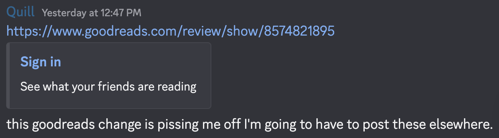
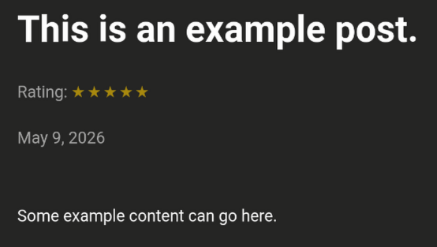
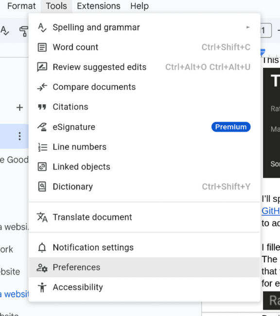
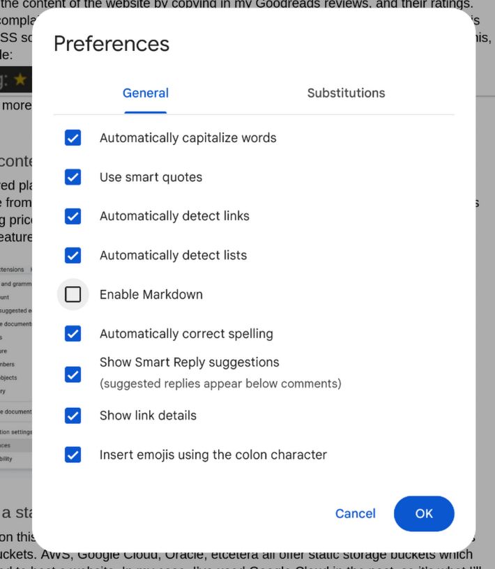

+++
title = "Building a Blog Because Goodreads Requires Signing in to Read Reviews"
layout = "single"
date = '2026-05-09'
draft = false
showreadingtime = true
showtoc = false
tags = ["Article"]
+++
## The Why

The title speaks for itself, but I'm going to elaborate anyways:

I had a rather annoying realization last week. I like writing reviews for the books I’ve read, and movies I’ve watched, and I like to send them to some of my friends over Discord. Imagine my surprise when on an otherwise benign Tuesday night, I drop a link into the chat and the site preview looks like this:  


Yet another website has decided that now you can’t do anything on it without signing in. I don’t want to send people a sign-on page, I want to send a link to a book review I wrote.

At the end of the day, writing reviews is something that I do entirely for myself. I don’t share them with my friends with the expectation that they will read it, just so that it’s there if they’re interested. I like reading their film reviews, and I like providing something in turn, but my ultimate motivation is to force myself to take some time to think through and have something to say about the media I consume. Said friends are also the target audience for this. Hi\! I hope I’m able to explain some of the technical details in a way that is interesting.

The point I’m glacially getting at is that this change to Goodreads isn’t one that affects me much; I’m not being majorly inconvenienced by Goodreads requiring a sign in to read directly-linked reviews. But I do find the fact that the embed doesn’t even say what book I wrote a review for upsetting, and I need to take the time to learn something new anyways. Goodreads is just another website in the long line of examples of things getting worse for incomprehensible reasons, and so I’m choosing not going to be beholden to Goodreads to host my content.

## The How

### How does hosting a website work?

Any website can be grouped into one of two major categories: static or dynamic. In simple terms, a static website is a collection of webpages that the user can request, that do not change on a per user basis. This means no logging in, no user submitted content to the website, and no access to an updating backend database. The advantage of this is that it means the “backend server” that runs a static website can be incredibly simple and cheap. You can run a static website by dumping all of the files into a cloud storage bucket and making it publicly accessible — Google Cloud’s Storage Bucket or an AWS Amazon S3 bucket are very popular, dirt cheap options. These static websites are Squarespace or Wix sites, or anything uploaded to GitHub Pages, to give an idea of the scope of what they do. It’s great for serving information cheaply, because at the end of the day all the web server is doing is making some existing files viewable in a browser — nothing is generated or evaluated server-side.

Dynamic websites are, well, dynamic. The content on them can change, moment to moment. This is every social media website, your Twitter, your Facebook, your YouTube, your Reddit, as well as a whole host of other online utilities and services. I personally run the [Final Fantasy XIV Astrologian Card Calculator](https://calc.probablyquill.com), which is a server written in Python that calculates the optimal targets for Astrologians to play their cards on. The Card Calculator needs to get information from the user, use that link to get data from FFLogs, process it, and then return the processed output to the user. This requires a server on the other end; it is not realistic for everything being done to happen in the browser. Not only is there a lot of math happening that I would prefer be executed under pandas instead of in JavaScript, but a website that accesses the API of another service has to be a dynamic website; you do not want the front end of your website to include the API keys that you use to tell a website you’re authorized to get information from it. Doing so would mean that your API credentials are publicly viewable, and could be used by anyone for anything.

The largest advantage of static websites — if they work for your use case — is the lack of complexity and expense in hosting them. This blog website and the aforementioned Card Calculator are great examples.

The Card Calculator is a Python program using the Flask framework to dynamically generate webpages. This means that it requires:

- A computer capable of running a Python program.  
- Some form of back-end database  
- A way to access the FFLogs API  
- Something to properly serve the website that Python generates. 

This isn’t a great place to go into the full technical details, but the tl;dr is that this means I have a $5/mo Linode server that runs the Python program, a PostgreSQL database, and an Nginx reverse proxy. While technically not required, I also have an SSL certificate set up via Certbot/Let’sEncrypt.  

In comparison, this website needs:

- A Google Cloud Storage Bucket

As with the Card Calculator, while technically not required I do use something to give the website an SSL certificate: Google’s HTTPS Load Balancer. Looking at these two sites isn’t exactly a fair comparison; the Card Calculator is, obviously, much more complicated than a blog. Even still, serving this same content directly from a dedicated server would still require a program set up to do so e.x. Nginx. It’s not overly complicated to do, but by forgoing manual hosting we’re offloading the management of distribution to the storage bucket instead of maintaining an application ourselves. While not relevant to this small website, this also makes it trivial to have data be distributed across multiple regions.

The lack of complexity means that not only is the website itself simpler, but it is also cheaper and less involved to host the website. Some napkin math says that I would have to serve hundreds of thousands of page visits for the cost of hosting from a Cloud Storage Bucket to catch up to the $5/month I pay for the Linode server that acts as a reverse proxy and database for the Card Calculator. Not even mentioning that the storage bucket would handle hundreds of thousands of visits more gracefully than the 1 core, 1 GB RAM Linode server.

Another point of consideration is how frequently the website is going to be updated. Dynamic websites can have some sort of admin portal, or something similar, where you can go and upload content while directly on the website. A static website requires you to create and upload/update the files externally. In this case, if I were planning on updating this website multiple times a day, it would make sense to more strongly consider some kind of dynamic website solution to save time. Something like a Wordpress blog with an admin panel and a field to create new blog posts, or one of the dozens of other options with similar or identical functionality. Ultimately choosing between a static and dynamic website are matters of convenience; a dynamic website can do everything a static website can, but if you don’t need to use some kind of database, you can save yourself a lot of effort just using a static website.

If you’re interested in a full  breakdown, [here](https://www.networksolutions.com/blog/static-vs-dynamic-website/) is an article by Joan Lora posted on Network Solution that goes deeper into the details, and gives more examples.

### Selecting a framework

Now that we’ve established the goal of building a static website, we can follow one of two paths:

1) Write a website fully from scratch, formatting every page manually.  
2) Use a Static Site Generator (SSG) — a program that uses templates to generate a static website.

In the context of a blog (and also really for any site that’s going to have increasing amounts of content over time) the latter is immediately more enticing. There’s a lot of options for doing this as most systems used to run dynamic websites are also capable of rendering that dynamic output into a static collection of pages to serve. The aforementioned Flask can use a module called [Frozen-Flask](https://github.com/Frozen-Flask/Frozen-Flask), [Next.js](https://nextjs.org/) is great at creating React-based static sites, and Wordpress can render its sites to static HTML with [Simply Static](https://wordpress.org/plugins/simply-static/). In my case and with my experience, Flask’s Frozen-Flask would be my go-to — but in this specific case, I was more interested in learning something new than using something I’m already familiar with, so I took a look at some alternatives. One of the advantages of using dedicated SSGs over retrofitting something like Flask is that I’m also far less likely to encounter any strange behaviors that are difficult to decipher.

I ended up landing on [this website](https://jamstack.org/generators/), which gives quite a few to look at. Next.js is interesting, and probably something that I should learn eventually, but I don’t particularly enjoy writing JavaScript nor do I know anything about React. There is a trend here: a lot of them use JavaScript-based frameworks for their templating — React, Vue, Svelte — if not as a requirement, then as an option. Again, I don’t know nor particularly want to learn any JavaScript frameworks right now, which strikes Next.js off the board, and makes several other options less enticing. They aren’t bad options, but I don’t have npm installed on my current desktop yet and I’m happy to keep it that way a little while longer. I took a look at Hugo, and its templating is reminiscent of Jinja2 — the templating engine I’m familiar with thanks to my experience with Flask. It’s also quite popular, which means that there’s a lot of existing templates and documentation to use for reference. I’ve never used Go before, but I don’t actually expect to write any Go-specific code, since I’ll be working within the templating framework.

### Building a static website

Static Site Generators work by using templates to turn content files into a usable website. You can build a theme from scratch — and, if you’re trying to get a stronger understanding of Hugo, that is certainly the best way to do it — but in my case, I care more about getting something set up quickly. I’ll make whatever adjustments I desire to the templates as I go. Hugo is well established; there’s a large number of [themes](https://themes.gohugo.io/) available to choose from on their website. I’m quite basic and easy to please; as soon as I saw the [hugo-paper](https://themes.gohugo.io/themes/hugo-paper/) theme and its dark mode I felt like it was a good fit for the type of aesthetic I enjoy seeing on a website.

Hugo is a good fit for me and what I’m trying to do, but if you don’t have a background in programming there are better or quicker options for you. In my case, I want the flexibility to experiment with the framework and be able to make any modification I’d like. In my case I intend to handle generation and distribution manually, but Hugo is compatible with various Content Management Systems as shown [here](https://gohugo.io/tools/front-ends/). 

After both Hugo and its theme are installed (the process varies based on the operating system and how you’re retrieving the theme) I started looking at what features weren’t present in the theme that I would like to add. The stand out, given that this started as a mirror for my Goodreads reviews, is some kind of star rating system. 

To explain how I solved this, the first thing to do is explain how Hugo lets you store data in your content files. Hugo’s preferred format for content is Markdown, a commonly used formatting system which a lot of people are at least somewhat familiar with thanks to Discord’s modified, incomplete support for it. Think, surrounding a message with asterisks or underscores to italicise them, double asterisks to bold text, pound signs for headings, etcetera. By default, Hugo templates start with the following parameters at the top of the file:

```markdown
+++
date = '2026-05-09T13:19:02-04:00'
draft = true
title = ‘This is an example post.’
+++
```

For the purposes of adding a rating, it’s as easy as adding an additional parameter:   
```markdown
+++
date = '2026-05-09T13:19:02-04:00'
draft = true
title = ‘This is an example post.’
rating = 5
+++
```

We can then reference this parameter later inside of the template code, and use it to display HTML content. It’s worth repeating as we continue that I don’t know Go at all. Luckily this doesn’t matter too much; since we’re working within Hugo’s templating language any scripting we do is going to be pretty straightforward. 

The review rating, that is, number of stars, needs to show up in two places, first on the page of the review itself, and second beneath any listing that links to the page with the review. The first step is to figure out how to actually display the star ratings on a webpage. As with a lot of this, these problems have already been solved.  The solution that I liked the most was discussed in another Hugo blog, [TechTea](https://techtea.io/notes/2024/03/adding-star-reviews/), which uses a solution adapted from this [css-tricks](https://css-tricks.com/five-methods-for-five-star-ratings/) article. It uses some CSS that I don’t really understand to style a star rating using unicode star symbols. The template I’m using allows for custom css to be added via creating a file at assets/custom.css, so it’s as simple as copying the CSS styling from the TechTea blog into there and putting the following into the single.html template file:

```html
{{- if .Params.rating -}}
     <p class="text-lg mt-0">Rating: <span class="Stars" style="--rating: {{.Params.rating}};" aria-label="Rating of this product is {{ .Params.rating }} out of 5."></span></p>
{{- end -}}
```

This leaves us here:



I’ll spare you the details of the rest — if you’re so inclined, the source code for this blog is available on my [GitHub](https://github.com/probablyquill/blogsite); I mostly wanted to highlight how easy it is to add “variables” to a post via Hugo’s [Front matter](https://gohugo.io/content-management/front-matter/) system.

I filled out the content of the website by copying in my Goodreads reviews, and their ratings. The only complaint that I have with this system, which I’m sure I’ll come back to eventually, is that this CSS solution doesn’t handle partial star ratings well. A 3.5 star review looks like this:  

Decidedly more than half of a star. It’s something I’m sure I’ll feel the urge to clean up in the future, but since Goodreads only uses whole-stars for ratings anyways, I don’t feel the loss yet.

### Adding content to a website

My preferred place of writing has habitually been Google Docs. It’s incredibly convenient, accessible from anywhere, and as Google has already claimed ownership of my soul there is no ongoing price to pay for the service. In the case of working with Hugo, though, there’s a fantastic feature that, as far as I can tell, is exclusive to Google Docs.
<div style="display: flex; height: 400px; width: auto; margin-left: auto; margin-right: auto;">
    
    <div style="width: 5%;"></div>
    
</div>
Under the tools’ preferences menu, there is an option to directly enable markdown. This means you can both use some Markdown features inside of Google Docs, as well as allowing you to copy content out of Google Docs formatted as Markdown. This is great because it immediately gets us \~95% of the way there. Doing this also copies the images present in the document, it reencodes them as Base64 data and includes them at the end of the markdown file. This is great in theory, but in practice a lot of images lose too much data from the conversion to still be usable. From here the document only requires the earlier Hugo header, and a bit of cleanup to ensure that code blocks and images are displaying properly, and then the post is good to go. If any of the images aren’t working as well as desired, they can be included in the same folder as the markdown and included from there.

### Hosting a static website

I touched on this a bit earlier: one way of hosting a static website is to use a cloud provider’s storage buckets. AWS, Google Cloud, Oracle, etcetera all offer static storage buckets which can be exposed directly to the internet — meaning that accessing their files from a browser loads it as a webpage. In my case, I’ve used Google Cloud in the past, so it’s what I’ll be using here as well. From my single comparison (AWS versus Google Cloud) they seem to be priced nearly identically, so it seems to come down to the matter of preferred platform instead of cost. 

I’ll be glossing over a lot of the details and only elaborating on the things that I find interesting, Google Cloud’s documentation provides a far better [step-by-step walkthrough](https://docs.cloud.google.com/storage/docs/hosting-static-website) if this is something you desire to replicate yourself.

The overview of the process is:

1) Create a Google Cloud Storage Bucket  
2) Make the bucket publicly accessible   
3) Enable load balancing   
    - This gives us the ability to use SSL for HTTPS. It’s optional but nice to have.*
4) Point our domain at the load balancer.

<sub>* You may be reading this and noticing this site isn't using SSL at time of writing. I've added a post-mortem to the end of the article explaining why.</sub>

Getting the backend set up isn’t interesting; Google’s walkthrough is very detailed and can be followed to the letter. The bit that I find interesting is how I’m going to streamline uploading and updating content to the storage bucket. Frankly, the idea of manually opening the Google Cloud console and uploading the website sounds tedious and annoying to manage, and I’d rather have it set up to fire off at the press of the button.

This is, of course, something that Google supports. There are a myriad of ways to interact with their cloud platform without ever touching a web browser, from Python to Terraform, but the one that I’m interested in is their command line application, as this makes it trivial to create a script that can handle the entire process of generation to uploading from start to finish. I’ve attached a simple script below that generates the site and uploads it to my Google Cloud storage bucket, within a single bash script. It’s a very convenient tool and I’m sure if I used Google Cloud more, I’d use their tooling a lot. As it stands I’m just using it for this single automation task, after following the instructions for setup and user validation [here](https://docs.cloud.google.com/sdk/docs/install-sdk).

```bash
#!/bin/bash
# Ensure that we are in the correct directory.
cd /home/elijah/Documents/GitHub/blogsite/

# Remove existing public files (not strictly necessary).
rm -R public

# The “hugo” command will render the website out into the public directory.
hugo

# Copy the contents of the public folder to the Cloud Storage Bucket
gcloud storage rsync public gs://blog.probablyquill.com/ --cache-control max-age=0 --recursive --content-language en
```

That means my start-to-finish workflow when adding new content is:

- Create the content in Google Docs  
- Copy it as Markdown into a content.md file.  
- Use Hugo’s built in server to ensure everything is rendering correctly.  
- Run the script to generate and push the website to the storage bucket.

## The Result

I’ve quite enjoyed using Hugo. It’s an interesting tool with a large amount of community support, and I’m sure I’ll find more reasons to use it in the future. I’m not a stranger to HTML, CSS, or JavaScript, so while I used a pre-made theme as a basis this time, I’m sure I’ll eventually look into building a custom one from scratch. I can’t say working with CSS is my favorite passtime, but it’s more so an issue with my ability to create usable layouts than an inability to use the technology. Pre-made themes save a lot of time, but it does come at the cost of my website looking very similar to any other website using the hugo-paper theme. As it stands I’ll keep adjusting the theme to my liking, and maybe one day I’ll get around to creating a custom one from scratch.

Ultimately this is something I could have added to my existing Linode server instead of hosting in a storage bucket. It would be perfectly capable of serving this website alongside the Card Calculator if I edited the Nginx configuration files to support another site. But, since the end goal was to make it as hands-off as possible after the initial setup, I’m quite happy with this solution. I don’t need to worry about SSL or being responsible for the web server. My ideal is that from my end, I’ll create the content, check it, and fire it off to the bucket. It’s quite possible to achieve the same thing with Nginx, but it would be a bit more work and I don’t want to flood my Linode server with services. I certainly don’t want to pay for or manage an additional VPS.

I will keep uploading my reviews to Letterboxd and Goodreads. Both sites offer features that I don’t have any desire to create and maintain, but having a custom blog means that I can enjoy tinkering with it, and have a place to host any additional content I decide to write, such as this article. It also means that should Letterboxd roll out the same “feature” as Goodreads, I already have a place to post reviews without requiring a login.

## Addendum

### 2026/05/10

Reading through this, you may have noticed that despite me talking about it, this website is not using SSL. Due to a misunderstanding of Google Cloud’s billing system, I’ve dropped the SSL support provided by their Load Balancer and am serving content via HTTP from the bucket. I’m a bit miffed by it, and it makes me a whole lot less likely to continue using their service as a whole. Specifically, it’s not entirely clear how much I’m paying for the static IP addresses. The day after initially setting up the load balancer, I’d accrued $0.50 in charges despite there being no content hosted on the storage bucket except for a placeholder, two line index.html file.

If having the pair of redirects is going to cost \~$15/month, there is no value in having the platform manage SSL for me. I can tack it on to the same Nginx reverse proxy that serves the Card Calculator. I’d rather not, for the reasons outlined earlier, but I’m happy to take the tradeoff of being slightly more proactive with management as opposed to paying $10-15 a month.

To a degree it makes sense; I don’t expect the service to be free and there are a limited number of IP addresses. I’m sure Google doesn’t want me digging into their supply for free. At the same time, I do not feel like it was made clear to me at time of setup that there would be significant charges attached to the IP address used to provide HTTPS support to the website. The networking charges were properly presented, but I’m finding myself frustrated with the fact that I was blindsided by the charge. I’m not even sure I’ve tracked down the source of the charge correctly, as on Google Cloud’s portal it just says “Networking”, and I’m struggling to get any meaningful elaboration out of their billing page.

### 2026/05/14

After spending a bit more time looking through Google’s billing information, I’ve tracked the unexpected charge to be a standard part of the load balancer. Per [Google’s documentation](https://cloud.google.com/load-balancing/pricing) on Load Balancing Pricing, it works out to $0.025/hr or $18.25/month. I cannot deny responsibility as I was the one who turned the service on, but my initial investigation into the cost pinned them to data throughput — which is priced per-gigabyte instead of hourly. Overall I’m still frustrated with how Google displays the usage charges. It was not obvious to me how much turning on the service would cost. It would be nice if the billing page was a bit more intuitive. It is, again, user error, but I wouldn’t have minded the platform doing a bit more to protect me from myself. I’ve worked with cloud platforms before so I’m aware that I need to check usage proactively, but it’s easy to imagine an unexpected bill at the end of the month. I’m just glad I caught it 70 cents in, instead of $20 in.

I will eventually decide that I want SSL working; I’ll probably keep the files in Google Cloud and filter traffic through an Nginx reverse proxy. I already pay for a VPS that runs Nginx, and eventually I’ll transfer the entire site over to it. Not being willing to use Google Cloud’s Load Balancer for SSL due to pricing means that, unfortunately, the majority of the benefits to using Google Cloud disappear. It’s also not difficult to [host a static site through Nginx](https://docs.nginx.com/nginx/admin-guide/web-server/serving-static-content/), so it should be a pretty easy change-over whenever I get around to it.