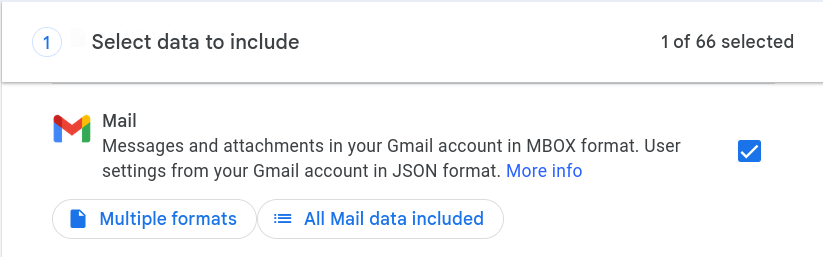
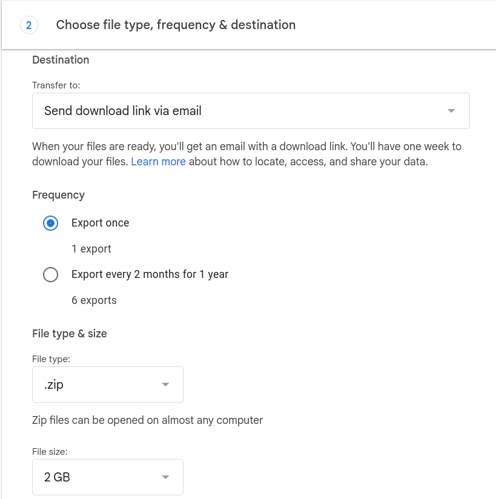

+++
title = "Reducing My Reliance on Google"
layout = "single"
date = '2026-05-31'
draft = false
showreadingtime = true
showtoc = true
tags = ["Article"]
+++
## Introduction
Earlier this year, I saw a now-deleted Reddit post about Google shotgun banning a collection of accounts due to misconduct on one. Per [this](https://blog.stackademic.com/a-14-year-old-did-something-stupid-with-googles-gemini-ai-his-entire-family-paid-for-it-37702c2b37a9) medium article the entire situation can be generously described as "unverified," but it got me thinking about my reliance on Google's services. It is, ultimately, a single point of failure held by a company that has no financial incentive to act in my interest. Google has the right to ban me at any moment, for any reason — if my Google account is banned, I lose access to my email, my cloud storage, my two-factor-authentication, my domains, and any other services or accounts tied to my Gmail. 

To put it succinctly: my Google account being banned, deleted, or restricted would be disastrous. It's crept up on me over the last decade and it's not something with a quick solution. I have no confidence that I could get real human assistance from Google's support, and even if I were able to actually talk to a person, I do not want my personal life to be at the mercy of a corporations customer support.

There's only so much I am willing to do; I don't have a desire to stop using Gmail nor would moving to a different email provider solve the underlying issue. I will always be beholden to whatever services I use — what I can do is diversify the services that I'm reliant on. By spreading my usage across multiple providers and ensuring that there are multiple ways for me to access or recover my accounts, I can protect myself and mitigate this single point of failure.

As it stands, the main services I'm concerned about are:
1. Gmail
	- Not only are my emails not backed up anywhere, but for the past decade my Gmail has been *the* email that I tie my accounts to. There's also a spattering of services that I've tied to Google's Social Login — a convenient one button login that stops being convenient if anything ever happens to the account.
2. Google Drive
	- It is no secret that Google scans your email, or files, or pictures; anything that touches their ecosystem is fair game. I would be lying if I said my move away from the platform was motivated by privacy — it's to make sure that I can keep access to my data even if my Google Account disappears tomorrow. Additional privacy is a bonus, to be sure, but my end goal is to reduce my reliance on Google as a platform. As it stands I have a lot of documents stored solely in Google Drive that need to be backed up, and as a part of separating myself from the ecosystem I will also need to find an offline replacement for Google Docs.
3. Two-Factor Authentication
	- I use Google's Authenticator app for my two factor authentication. This is great — unless something happens to my Google Account, and my 2FA codes are gone forever. I do not know if the codes, which appear to be stored locally on my devices but are still tied to my Google account, would survive said account being deleted. I would not be surprised if upon suspension of my account local codes were cleared.
## Gmail
I am not interested in self-hosting my own email service for a variety of reasons that all boil down to "my five minutes of research say it's a pain to keep major hosting providers from banishing my messages straight to spam." I flirted with the idea of moving off of Gmail, but it is both convenient and integral enough to my workflow that the effort of moving to another platform is not worth the benefits. What I need to do, then, is ensure that I am not in an unrecoverable position if my Google Account were to get deleted — or if I were to get locked out for one reason or another.

Considering the changes I'm willing to make — that is, that I'm not willing to move away from my Gmail entirely — the best path that I see moving forwards is:
1. Regular backups of my emails
2. Ensuring that, if possible, important account login(s) are not singularly reliant on my Gmail account.

The first point is simple enough; Google provides a service called [Google Takeout](https://takeout.google.com) that makes it simple to download information from your Google Account.



This will take a while to complete, so while waiting on the backup to finish, I can move on to the tedious task of investigating which account logins are reliant on my Gmail account. I'll find additional derelict accounts as I investigate, but I'll be starting with:
- Squarespace (Domain Registrar)
- Steam
- PayPal
- Spotify
- Tello 
- Various other gaming related accounts (Epic, Square, etc.)

> Most services *have* to be tied to an email — the ideal is to confirm the existence of or add additional recovery options such as a phone number or a secondary email account. 

My Squarespace account was set up as a Social Login — it was easy enough to disconnect it and use an email address directly. It is still attached to my Gmail, but I can now log in with the email and a password instead of having to funnel it through Google's social login. I also took the opportunity to set up 2FA. This does mean I lose the convenience of the Social Login, however if there were to be an issue with my Google Account I will still be able to access to my Squarespace account. Squarespace also supports adding a phone number as an account recovery option, though I am equally unsettled by the possibility of my phone being its own point of failure. That is not an issue I am confident in my ability to solve; I do not know what course of action I'm supposed to take if I were to lose my phone — or more importantly, the SIM[^SIM] card inside. That's an investigation for another day.

My Epic Games account also uses my Google Social login, but after thinking over it, I don't really care. They've bribed me with a vast volume of free games but haven't managed to invest or integrate me into the platform. On the other hand, I care a great deal about my Steam account. Regretfully I cannot do more than I already have; like Squarespace, my Steam account can be tied to one email address and one phone number. My understanding is that if you lose access to your original email, Steam has systems in place to let you prove ownership using things like credit card information or purchase receipts. A naturally manifested benefit of having offline backups of my emails is that I'll have copies of the aforementioned receipts regardless of how long ago the purchase was.

It's only tangentially related, but I've also realized that my password practices need some work. I imagine I'll be investigating password managers, or just overhauling my passwords, in the near future. I have gotten better about not reusing passwords over the past few years, but there is always room for improvement. [Password fatigue](https://en.wikipedia.org/wiki/Password_fatigue) is, unfortunately, very real and I've had my issues with it.
## Google Drive
The Google Drive suite of software is a fantastic collection of tools that — for me — has replaced Microsoft Office. There are two "zones" of functionality that I primarily benefit from: Google Drive's file syncing and availability, and the Google Docs and Sheets programs. The cloud storage is nice, and on occasion I use it to transfer files between devices, but the bulk of the content in my Google Drive is documents. I'm currently only using four of my available fifteen gigabytes, and three of those are a old video file that I am going to delete now that I've noticed it. While I'm "replacing Google Drive," the actual functionality I am targeting is giving myself access to my documents across multiple devices.
### Replacing Google Drive
Replicating the convenience of a trillion dollar company's cloud platform is unfeasible, but with some compromise I can get closer than you might expect. I'm uniquely pre-equipped for this undertaking as I already have a home server with a NAS (Network Attached Storage) set up, and I'm already able to access it anywhere via a VPN (Virtual Private Network). There are caveats to this: working directly off of a Network Share can be obnoxious, my home server represents a new single point of failure, and at the end of the day my house doesn't have a static IP address. These combined mean I cannot ensure my home server is always available, ergo I cannot just work directly off of the NAS as my files are only available if I can reach my home server. This is not an issue while the NAS and VPN are working, but any unexpected hiccups — such as my router rebooting, and pulling a new IP address — mean that I would temporarily lose access to my files.

We can get around this in the same way that Google Drive allows you to work offline — syncing our local files with the server. Of the options I came across in my research, I picked [Unison](https://github.com/bcpierce00/unison) due to its versatility, simplicity, and open-source status. My current computers are on various Linux distributions, but should I ever require it, Unison can be set up on MacOS or Windows. There is one major downside to this: should any file conflicts arise, I will need to manually handle them. File conflicts occur when the version of the file on the server and the local version of the file have both been edited and are in "conflicting" states. There are ways to smooth this out; my current solution is to use Unison's "copyonconflict" flag, which does as the name implies.

I was quite pleased with how quickly I got Unison up and running across my Laptop, Desktop, and home server. I'll spare you the technical details — if you're interested my profile, scripts, and systemd service will be uploaded to my GitHub — but the TL;DR of the process is that I've created a service and configuration that I can install onto any Linux machine. Again, there are caveats to this: said machine needs to be capable of reaching my home server, which in the context of my network configuration means it needs to be delegated have a unique VPN profile. If I were willing to expose my home server to the open internet via SSH I could sync without a VPN connection, but I prefer my VPN being the entry-point for my home network as it provides access to other services running off my home server. I should clarify that though I've discussed Unison in the context of syncing with a mounted network share, Unison is also able to perform syncs over <u><dfn title="Secure shell: a protocol for remotely accessing a computer over the network.">SSH</dfn></u>. This does require Unison to be installed on the server as well, which means if you try to replicate this system with an off-the-shelf NAS you may not be able to get it to work. At the moment I am running Unison via SSH on my Desktop, and syncing via an SMB share on my Laptop; I expect I will end up switching both to SSH but the Debian version of Unison does not ship with the "repeat = watch" functionality that I'm using on my laptop, and I have not gotten around to recompiling it — in part because syncing via the network share has worked flawlessly.

Unison is a great starting point, but I'm ultimately still afraid of the possibility of a disaster happening on site and causing me to lose my data. The bare minimum to meet best-practice data storage standards is to follow 3-2-1: three copies of your data on two different media (devices) with one offsite. Using Unison to sync my laptop with my NAS gets me a solid chunk of the way there, but I wouldn't consider my home server to be "offsite" even if it's often not in the same physical location as my laptop.

I've wanted remote backups for files before — last time for the world of a Terraria server — so I already have an established system. A saving grace in this scenario is that the valuable files are documents; I'm not going to be syncing huge amounts of data which means I'm not on the hook for large amounts of storage. I already have a VPS (Virtual Private Server) in the cloud hosted by Linode, and it comes with 25 GB of storage that I've barely tapped in to. This makes it a prime candidate for daily remote backups using a simple script and a cronjob[^CRON]:

```bash
#!/bin/bash
fileName=$(date '+%Y-%m-%d')_backup.tar.gz
echo $fileName

# Compress file
cd /backup/filepath && \
tar czf /tmp/$fileName --exclude='.*' Documents

# Copy to server
scp /tmp/$fileName backup@server:/backup/notes/$fileName
rm /tmp/$fileName
```

This script makes a compressed copy of the NAS' data and sends it off to the VPS. I will have to check in periodically and make sure I'm not filling up the storage, but so long as I stick to documents and a couple of images, I don't expect space to be an issue. At time of writing the compressed backups weigh in at a measly 131 KB. I've also set up an additional cronjob on the server to occasionally cull the backups. While I'm trying to make my backups as overkill as possible, I am also using [Rclone](https://rclone.org/) to sync encrypted backups to my Google Drive as an additional off-site backup. I have the storage and account, there's no reason not to use it, but if I'm going this far I may as well encrypt the data[^ZIP].

```bash
#!/bin/bash
fileName=$(date '+%Y-%m-%d')_backup.zip
echo $fileName

# Create encrypted zip file.
cd /backup/filepath && \
zip -r --password secret_password /tmp/$fileName Documents -x ".*"

# Send to Google Drive
rclone copy /tmp/$fileName gdrive:/backups
rm /tmp/$fileName
```

I want to emphasis again that there is one massive downside to all of this: I cannot access it from any computer at any time. A new device needing to connect via VPN then install Unison or (more realistically) mount an SMB share is a monumental barrier compared to what Google Drive offers. There are ways to get around this, but I'm not interesting in pursuing them — ultimately this is a system that works for me personally, but something I consider a mild inconvenience could be a deal breaker for someone else. A lot of people have put a lot of work into a lot of different solutions for these kinds of problems, and I would encourage you to consider exploring options and [alternatives](#alternatives-to-google-docs) if, like me, you would like to be less reliant on Google.
#### Fitting in a Phone
Unison is a great tool, but it being my central focus leaves a glaring gap in my process: my phone is unable to sync with my server. Unfortunately — as far as I could find — there isn't any way to set up Unison on a mobile device. This means that I have to turn to another tool, though this is yet another solved problem. I ultimately decided to use an app called [FolderSync](https://foldersync.io/). There is a base, free version with limited features and advertisements, but it works well for my use case of maintaining parity with an SMB share. This solution is not perfect; FolderSync performs a sync every five minutes and I would prefer the option to attempt a sync every minute, or to sync on file changes. I assume these might be included with a license, but I have not actually checked. I was mildly worried that this solution would have a negative effect on my phone's battery life, but after using it for a few days I am pleased to report that I have not noticed any depredation, nor is my phone reporting that the app is using a notable amount of battery life.

I don't intend to use FolderSync for anything but my phone, but I do want to mention that I appreciate how their licensing is structured. A license for Android is a one-time purchase of €9.95 (around $11.50). Their desktop sync license is a harder swallow at about €30. If I do end up sticking with FolderSync, I will purchase an Android license, but I don't see myself migrating my entire stack to their platform. I don't *need* a license for what I'm doing, but I do respect the pricing structure of a one-time purchase over a monthly recurring subscription.
#### The Result
The best part about the solution as I've described it is that I can account for six different copies of my data[^DATA], as it will sync between:
1. My Desktop
2. My Laptop
3. My Cell Phone
4. My Home Server
5. A Linode VPS (Daily)
6. Google Drive (Encrypted, weekly)

This isn't a silver bullet; if I want to store larger amounts of data, I will need to revisit my solution to be able to accommodate additional storage requirements. At the moment I can store all the documents I could ever need, but if I decide to start backing up photos and videos then there could be issues in the future. 
#### Alternatives to or Supplementing Google Drive
I am well aware that replacing Google Drive in this manner is not feasible for everyone — not everyone has the hardware or experience that I do. There are other options if you want to insulate your files from risk, one of which is taking advantage of Google Drive's offline sync. If you just want to ensure physical, on-premises access to your files — and to ensure that they exist in a place other than Google's Cloud — [Drive For Desktop](https://support.google.com/a/users/answer/13022292?hl=en) is probably the best solution for you. Combining this with Google Takeout means that so long as you can locally match (read: can spare double[^BITS]) the amount of storage you're using on Google Drive, you can keep a back up copy and a local sync to ensure you have offline copies of your data. Even only grabbing an occasional Google Takeout backup is a monumental step; doing _anything_ that gives you a separate copy of your data makes it far less likely that your data can ever be lost.

If your goal is to diversify the services you use, another option is to pick a different service as a drop in replacement. There are several alternatives to Google Drive that more or less match its functionality. I wouldn't consider this a substitute for having a backup of your data, but some services offer features that Google Drive does not, whether that be a focus on privacy or simply a different structure for data storage costs. The largest downside to abdicating Google Drive, from what I've seen, is that (almost) every alternative services' free tier offers less storage than what comes with your Google account.

[Proton](https://proton.me/drive) is a service that advertises itself as being privacy focused, and offers an end-to-end encrypted alternative not just to Google Drive, but also much of the Google suite. Fully migrating to Proton's services would put me in the same position I am now: vulnerable to the whims of a single (though ostensibly more customer-focused) company, and it would not address my desire to avoid using a company's cloud as my primary storage solution. Its free tier offers 5 GB of storage, and from what I've read they really do take customer privacy seriously. When subpoenaed by the FBI the only information they were able to provide was a credit card number[^PROTON]. Certainly an identifier, but if that's the only data that they have which can be tied to a specific user then I do think they are succeeding with their mission of privacy.

[Dropbox](https://www.dropbox.com/) is still around and offering 2 GB of storage on their free tier.  I suppose I should also mention [OneDrive](https://www.microsoft.com/en-us/microsoft-365/onedrive/onedrive-plans-and-pricing), and its free tier that provides 5 GB. [MEGA](https://mega.io/) offers the most storage out of all the options, including Google Drive, beating them out at 20 GB, but when using the free tier there's a daily limit on downloads — though I don't know exactly what that limit is or how restrictions manifest. I don't know much about the company, but it felt worth mentioning based off the large amount of free storage alone. I'm mostly mentioning these for posterity's sake; Proton would be my service of choice if I were looking to replace Google Drive with a direct alternative.

I want to emphasize that I do not believe Google Drive is some horrible service that should not be used; my issue stems from the fact that I have identified my Google Account as a single, major point of failure due to its singular importance in my personal life. If something triggered Google to ban or restrict my account, I need to make sure that I still have access to my data. I went a bit overboard with my personal data storage solution — certainly in part because it made for an interesting project — but I would encourage you to stop and think about your personal reliance on digital services. How would you be impacted if some day a company devices they will no longer provide you their service?
### Alternatives to Google Docs
In my article on [why and how I created this blog](/post/2026/articles/buildingablog/), I talk about how I take advantage of a feature of Google Docs to translate my writing into Markdown, which is then combined with templates to generate this website. I've come to the conclusion that it makes just as much sense to write everything in Markdown in the first place. Google Docs was ultimately a means to an end; "copy as markdown" is a nice feature, but the real reason I was using it is because Google Drive made my documents accessible regardless of what computer I was using. The combination of Unison and FolderSync is a close enough replication of the accessibility that Google Drive gave me for me to comfortably move away from Google Docs.

This means that I'm free to pick any offline editor that catches my interest. I do not have many requirements — all I need is something that can display text, handle some simple formatting (via Markdown), and can display images inline. This lead me to a tool I have heard good things about and considered using before: [Obsidian](https://obsidian.md/). I'd looked into it and found its feature set, plugin support, and design philosophy interesting, but I'd never gotten around to giving it a try. A huge bonus of Obsidian is that, like Google Docs, it has an app available on just about everything. I can run it on my phone and my desktop, and using the previously discussed methodology for syncing means that my notes are immediately accessible from anywhere. Being able to keep the same tooling across devices — Linux, Windows, MacOS, or Android — makes working across devices easy and convenient. Obsidian also offers their own paid syncing service, and you could also use something like Google Drive's offline access to achieve a similar effect. Obsidian being a markdown-based editor means it meshes well with my existing workflow, and the application itself (especially extended by its plugin[^PLUGIN] support) just has a lot of interesting and powerful features. While I appreciate Google's option to copy as Markdown — it saved having to convert the document through something like [Pandoc](https://pandoc.org/) — it makes as much sense to use Obsidian and write the document in Markdown in the first pace.

Even should I decide to move away from Obsidian, I have a feeling that I'll stick with Markdown-based editors for the foreseeable future. Markdown is a well established markup format so I'll never be pressed for options; I'll always be able to continue right from where I left off using other programs such as [Notion](https://www.notion.com/). I do not miss any features in Markdown compared to a dedicated word processor because my use cases don't demand any formatting more advanced than section headers and bullet points.

I haven't gotten around to playing with Obsidian's most interesting features, as I haven't gotten around to importing my existing notes nor have I written anything other than this article, but I really appreciate software tooling that makes my computer enjoyable to use. I like that Obsidian allows both official and community plugins, and at some point I'm sure I'll get the urge to dive in and give creating a custom plugin at try. Obsidian feels smooth and is non-obstructive, and has the added bonus of supporting in-lining HTML with CSS styling. Normally I would consider the application being built on Electron to be a minor point against it, but in the context of what I do Electron is directly beneficial thanks to the aforementioned HTML rendering.
#### The Rest of the Google Suite
The fact of the matter is: I'm not going to replace Google sheets. I'm no power spreadsheet-er; on the odd occasion that I need to make a spreadsheet for something I'm perfectly happy just opening a web browser. As I take regular backups of my Google Drive any Sheets will be included, but the existing one or two I'd be sad to lose were already backed up when I downloaded my Drive data from Google Takeout earlier. Google Takeout downloads Google Sheets files as .xlsx files, and Google Docs as .docx files, so they can be imported into other word processing or spreadsheet software should I ever need to work off one of those backups.

If **you** are looking for alternatives to Google Sheets or Google Slides, the [LibreOffice](https://www.libreoffice.org/) suite is worth giving a try. I should also acknowledge that the original software suite I abandoned, Microsoft Office, offers a lot of what I am now looking for. I have my own growing disillusionment with Microsoft, but if you are on Windows or MacOS the Office suite might fit your use case especially if combined with a cloud platform's offline sync. I don't think it's worth the effort for me to even try it — while it is *possible* on my Linux systems, possible isn't worth the effort. Either way, Microsoft's Office Suite and LibreOffice checks the box of offline editor, with .docx, .xlsx. and .pptx being well-supported[^DOCX] file formats due to their popularity — and both software suites also support a solid number of other formats without having to go through a converter such as the aforementioned Pandoc.
## Two Factor Authentication
While I don't have a large number of services tied to my Google Authenticator app, it would be a major issue if I were to lose any of them. I've never migrated a 2FA service before — I don't even recall when I set Google Authenticator up — but my hope is that it will be straightforward to do without having to reconfigure my existing authentication.

Before I can even start figuring out how to add an additional authenticator, I have to determine what authenticator to add. My vague understanding of how Two Factor Authentication works is that there's a master key used to generate 2FA codes based on time. This standard that Google Authenticator and its contemporaries use is called Time-based One Time Password, or TOTP, and from my understanding is the current "best-practice" method of two factor authentication. Importantly: [it is an order of magnitude more secure than using SMS]([https://stytch.com/blog/totp-vs-sms/](https://allthingsauth.com/2018/04/05/totp-way-more-secure-than-sms-but-more-annoying-than-push/)). 

Quite a few different options came up when I started searching for alternatives, to the point that the sheer number of seemingly-identical apps was a bit overwhelming. Google has an app, Proton has an app, Microsoft has an app, apparently Apple has one built in to their Passwords app, and some password managers also include TOTP authentication — not to mention other bespoke 2FA apps not backed by a major company — and that's barely scratching the surface. [Ente Auth](https://ente.com/auth/) quickly caught my attention due to (seemingly) being the most popular <u><dfn title="Free and Open-Source Software">FOSS</dfn></u> application. I'm somewhat antsy at the idea of a service provider I'm not familiar with storing my 2FA keys, so at least for now I think my solution will be to set up an offline only device that uses the app account-free to have a backup in case something happens to my Google Account or primary phone. Ente Auth is able to work both ways, either using an account or working solely offline, so I've set up a backup device as the latter, and it will stay buried in my room until I need it.

The immediate roadblock I encountered was that the services I checked did not allow the registration of multiple 2FA apps, or more specifically did not allow multiple TOTP secret keys to be generated. My initial assumption was that I would need to delete, then re-add both authenticators at the same time to be able to have the codes on both. I was quite happy to be wrong — Google Authenticator allows you to export your saved codes to another device via a QR code. This is intended to be used to copy or transfer your codes to another device using the Google Authenticator app, but several other apps support importing TOTP via this QR code, including the aforementioned Ente Auth. Getting Ente Auth set up as my backup was as easy as installing it, hitting a button to import codes from Google Authenticator, and scanning a QR code. I still have Google Authenticator as my primary method of two factor authentication, but I also now have a backup device and copies of the 2FA keys. It's such a quick and painless process that, if you have an old device on hand somewhere that you can use as a backup, I would recommend taking a few minutes to get it set up just in case something ever happens to your primary 2FA device.
## There Is No Escape
Early on while working on this project, I came across this [New York Times article](https://www.nytimes.com/2022/08/21/technology/google-surveillance-toddler-photo.html) which hits the same ideas as the Reddit thread I mentioned at the start — while also having demonstrably happened.

> *Not only did he lose emails, contact information for friends and former colleagues, and documentation of his son’s first years of life, his Google Fi account shut down, meaning he had to get a new phone number with another carrier. Without access to his old phone number and email address, he couldn’t get the security codes he needed to sign in to other internet accounts, locking him out of much of his digital life.* [^NYT]

There are a million reasons to be skeptical of Google, or any company you've developed a dependence on, but the deal-breaker here is that there appears to be no recourse for false positives. The picture the New York Times article paints is that Google's rapid expansion has not been met with an equal or even adequate expansion of customer support, to the point that legal clearance isn't enough to guarantee that you can recover your account. For a service that wants you to trust it with your life, it's all too happy to cast you aside. You are the only one who will suffer consequences — the only way to protect yourself is to proactively prepare for the situation. Google has the right to ban you at any time for any reason. Plan accordingly.

I am still reliant on Google's services. This website is, at least for now, [still hosted via Google Cloud](/post/2026/articles/buildingablog#how-does-hosting-a-website-work). I still use Gmail, I haven't honestly considered switching off of Google Search, and the Android phone in my pocket is still reliant on the same Google Account I've spent all this time distancing myself from. I have not escaped Google, but that was never the goal — I don't believe its currently worth the effort. I still enjoy the convenience of Google services, but now I have taken precautions so that losing access to my Google Account would not be disastrous.

[^SIM]: A SIM card is the chip inside of your phone that is used to identify it, and give you access to the carrier's network. In recent years there's been a move towards eSIM cards, or "virtual" SIM cards that don't require a physical chip. Looking into converting my SIM card into its digital alternative may be a solution "keep" it even if it is lost or stolen.
[^ZIP]: Standard zip encryption is famously weak, at some point I'll come back and use 7zip or gpg encryption instead.
[^CRON]: Cron is a program that ships with most modern Linux distributions; a cronjob is a scheduled task that will fire off at preset times.
[^NYT]: Kashmir Hill [via the New York Times](https://www.nytimes.com/2022/08/21/technology/google-surveillance-toddler-photo.html)
[^DOCX]: Well supported, but there can be formatting issues, especially when moving .docx files in-between different word processors.
[^PROTON]: [Proton: FBI user identification shakes Swiss data protection](https://www.heise.de/en/news/Proton-FBI-user-identification-shakes-Swiss-data-protection-11203086.html) by Stefan Kremp. It is worth noting that this is avioidable as Proton allows you to pay by mail or via crypto-currency. If the user had used an anonymous payment method, it is entirely possible that the FBI could have come after this user and Proton would have had nothing to offer.
[^PLUGIN]: You may have noticed all of the  em-dashes that I love to use so much, these are thanks to a [plugin](https://github.com/Jefrry/obsidian-em-dash-replace) I found that (nearly; there's no option for an en-dash) replicates the way Google Docs lets you insert em-dashes. It's a small convenience, but it saves me from trying to type the alt code without a number pad, or manually copy-pasting each "—".
[^BITS]: Matched once for the synced data, and again for the additional, seperate backup.
[^DATA]: While six copies is technically true and I said it because it sounds impressive, my desktop, laptop, and phone should be considered at least semi-combined, as they will defer to whatever is on the server. The laptop and desktop are set up to store backup copies should there be any conflicts, the phone is not.